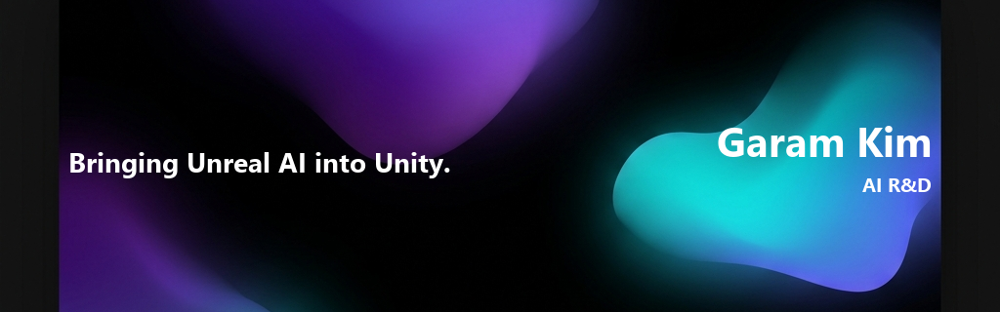

  

<h1 align="center">Garam Kim</h1>

  Bringing <code>Unreal</code> AI into <code>Unity</code>. 
  Making AI feel real. Software engineer → AI researcher.

  
  
  
  
  

---

### // about

Fundamentals forged at **Krafton Jungle**, plus the execution to absorb unfamiliar tech **top-down** — prototype fast by pairing with AI agents, then verify by hand. A long-time game developer at heart, now aiming to help make AI **native and approachable**.

- **Goal** — AI Researcher (AI R&D), at the intersection of games and AI
- **Focus** — LLM & SLM optimization · heterogeneous multi-agent systems · on-device LM compression
- **Learning** — Mesa · LangGraph · RAG & harnessing
- **Open to** — AI Research · AI FDE · AI Native

---

### // recent updates

<!-- START_SECTION:activity_svg -->

  

<!-- END_SECTION:activity_svg -->

  
<b>View commit logs as text</b>

   

<!-- START_SECTION:activity_list -->
- **dd5680e** - feat: shrink Unitrio logo, add View Portfolio button and update README Portfolio badge (27 minutes ago)
- **5f2d23d** - chore: auto-update recent commits in README [skip ci] (32 minutes ago)
- **7f11e34** - feat: add animated SVG terminal of recent commits and automate it with GitHub Actions (33 minutes ago)
- **0bab2d4** - design: add modern micro-interactions (33 minutes ago)
- **21ae772** - Increase slogan text font size to 44 on active banner image (41 minutes ago)
<!-- END_SECTION:activity_list -->

---

### // github stats

  

  
  

---

### // stack

**Languages**

  
  
  
  
  
  
  
  

**Frameworks & Libraries**

  
  
  
  
  
  
  

**Infra & AI Tools**

  
  
  
  
  
  

---

### // selected work

**EUM** · 2025.12 – 2026.01 — Browser-based AI video-meeting platform with real-time interpretation and a WebGPU infinite-canvas whiteboard. Owned the whiteboard full-stack: built a custom renderer on PixiJS v8 / WebGPU that lifted average frame rate from **23.7 → 58.7 FPS** at 60Hz. → [demo & write-up](https://jungle.krafton.com/news/103)

**HELIX** · 2026.04 — Heterogeneous multi-agent collaboration system to reduce hallucination and minimize API cost. → [live](https://helix-ssu.vercel.app/)

**Unitrio** · ongoing — A 2D top-down action-RPG sandbox, built with a five-person indie team.

---

Building in the spirit of Eiji Aonuma & Satoru Iwata. A lifelong Zelda player.

